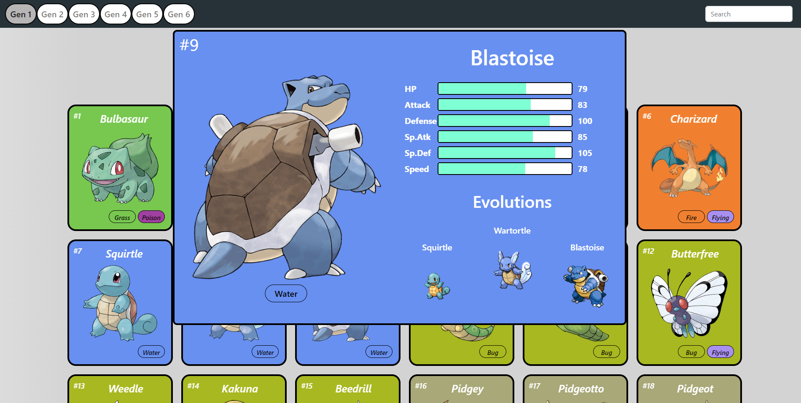

# Pokedex pokemon API - (Projeto em desenvolvimento !!)

Clique para ter acesso: pokedex-api-orcin.vercel.app

## Projeto

Desenvolvimento de uma plataforma web para listar, visualizar, buscar e favoritar pokemons. O projeto foi construído usando ReactJS. Todos os dados obtidos para construção da plataforma foram obtidos por meio de uma API REST chamada <a href="https://pokeapi.co/">PokéApi</a>

### Tecnologias
- React;
- JavaScript;
- HTML;
- CSS;
- <a href="https://react-bootstrap.github.io/">React Bootstrap</a>;
- <a href="https://www.npmjs.com/package/react-parallax-tilt">React Tilt</a>

### Funções

- Listar pokemons: Isso inclui os pokemons de todas as gerações, gerando requisições diferentes na API REST.
- Listagem em grupos: É mostrado para o usuário um número limitado de pokemons na tela para agilizar o processo de requição de informações.
- Renderização condicional: Requisitanto pequenos grupos de pokemons e a cada nova requisição a listagem anterior é somada a nova, aumentando o desempenho da plataforma.
- Buscador de pokemons: Filtragem de pokemons de acordo com o nome digitado.
- Efeito de carta para cada pokemon: Usando o component <a href="https://www.npmjs.com/package/react-parallax-tilt">React Tilt</a> para criar um efeito realista de inclinação ao passar o mouse em cima dos pokemons.
- Barra de progresso para atributos: Criação de uma Progress Bar para mostrar os dados de atributos de cada pokemon de forma iterativa, usando animação para preenchimento.
- Personalização do tipo: Visualização dos tipos de cada pokemon, adicionando cores únicas para cada.
- Árvore de evolução: Mostra todo o ciclo de evolução dos pokemons.
